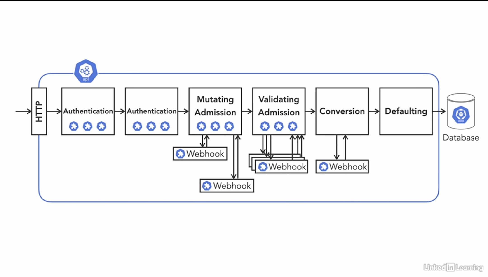
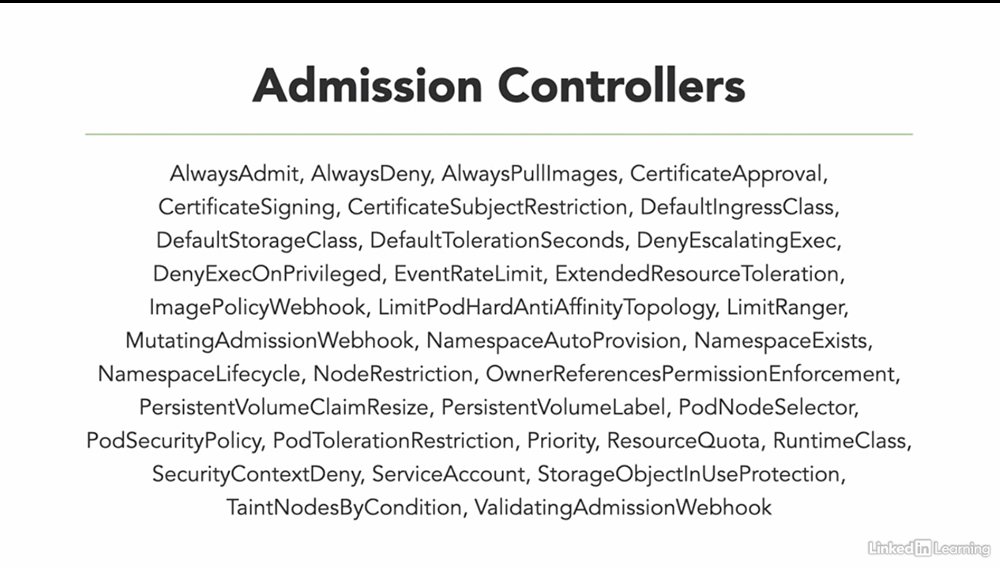
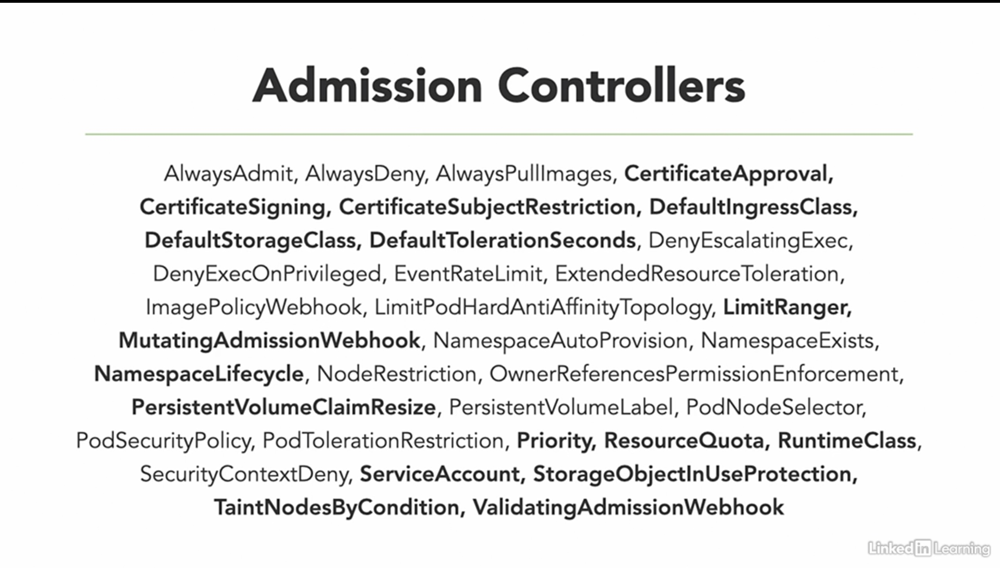

# Advanced Kubernetes

- [Advanced Kubernetes](#advanced-kubernetes)
  - [Architecture Overview](#architecture-overview)
    - [`apiserver`](#apiserver)
    - [`etcd`](#etcd)
    - [Making Things Happen](#making-things-happen)
    - [High Availability](#high-availability)
    - [Scaling with load](#scaling-with-load)
  - [The API Server: The Life of a Request](#the-api-server-the-life-of-a-request)
    - [Authentication](#authentication)
    - [Authorization](#authorization)
    - [Admission Controllers](#admission-controllers)
    - [Conversion](#conversion)
  - [References](#references)

## Architecture Overview


### `apiserver`
Allows clients (e.g. `kubectl`) to talk with the cluster.
Resource specifications can be submitted (with `kubectl apply`), running resources can be listed (with `kubectl get pods`), etc. via the apiserver.
Only the apiserver can access the database (etcd).

### `etcd`
This is the cluster's database.
The desired state of the cluster is stored here.

### Making Things Happen
Lets assume we want to create a Deployment on the K8s cluster:
1. Submit the Deployment config to the cluster via tha apiserver: `kubectl apply -f deploy.yaml`
2. The apiserver stores the declaration on the etcd database
3. The `controller-manager` (which constantly checks the etcd database -- via the apiserver -- for configs than needs additional declarations) picks up the Deployment declaration and submits appropriate Pod configs (e.g. if the Deployment has `replicas: 10`, it submits 10 Pod configs with randomly generated names)
4. The `scheduler` (which constantly checks the etcd database -- via the apiserver -- for declarations with no assigned nodes) picks up the Pod configs and updates the declaration to include a node on which to run. This updated config is then stored on the etcd database
5. The `kubelet` agent on each assigned node (which constantly check the etcd database -- via the apiserver -- for Pods scheduled to run on its host node) picks up the Pod config and runs the appropriate container(s) on its host
6. The `kube-proxy` agent on each assigned node (which constantly checks the etcd database -- via the apiserver -- for Service configs relating to its host node) picks up any Service-relevant information and applies the corresponding networking config on its host node

### High Availability


### Scaling with load
Kubernetes (K8s) clusters can be scaled:
- Vertically: Increase capacity of nodes (i.e., underlying VMs)
- Horizontally: Increase number of components

In increasing the number of nodes, some cluster components can operate with multiple simultaneous instances (e.g. apiserver, worker nodes, etc.) while others can not (e.g. controller-manager & scheduler).

In the case of controller-managers and schedulers, if multiple instances are available, a "leader election" is performed to decide which instance is active at any given time.
In the case of etcd, the operation mode is kind of like an hybrid. Multiple instances can be read-from simultaneously, but only one instance (the leader) can be written-to. Whenever new data is written to the leader, it sends copies of the data to the other instances such that each instance is up to date at any given time.

Leader elections are done on a component-level, not on a node level. I.e., at any instance, the lead scheduler and the lead etcd instance need not be on the same node. In fact, the desired behaviour is that they are not on the same node, such that if the node fails, they don't all fail together.

## The API Server: The Life of a Request


### Authentication
"Who are you? Can you prove it?"
This stage validates "who" a user claims to be.

K8s clusters have two categories of users: service accounts & normal users.
Normal users are managed by cluster-independent services, e.g. a username-password file, or Google Accounts. Normal users cannot be created via the K8s API.

Service account users are managed by K8s. They are bound to specific namespaces. Some are created automatically, while additional ones can be created manually via API calls.

### Authorization
"What can you do?"
This stage validates what actions an authenticated user is allowed to perform.

Most K8s clusters use Role-Based Access Control (RBAC) for authorization.


### Admission Controllers
They are plugins that intercept requests and can mutate (mutating admission controllers) or validate (validating admission controllers) resource requests.
They are user-controlled, i.e. can be turned on/off via API calls. However, command-line flags at execution-time are required to change default on/off behaviour.

Some admission controllers:


Some default-on admission controllers:


The "MutatingAdmissionWebhook" and "ValidatingAdmissionWebhook" can be used to extend admission controllers to include custom user-defined functions via the `MutatingWebhookConfiguration` and the `ValidatingWebhookConfiguration` resources respectively.


### Conversion
Allows the supply (or retrieval) of resource definitions in any API version supported by the cluster.

For example, if an `rbac.authorization.k8s.io./v1beta1` resource definition is applied,
the conversion stage automatically converts it into an `rbac.authorization.k8s.io./v1` resource.
If the resource is queried, e.g. with `kubectl get role role_name -0 yaml`, the more up-to-date definition (`rbac.authorization.k8s.io./v1`) is returned.
However, the "deprecated" resource definition can be queried using `kubectl get role.rbac.authorization.k8s.io./v1beta1 role_name -o yaml`.

```shell
# list available api versions
kubectl api-versions

# describe api resources
kubectl api-resources 
```


## References
- [Advanced Kubernetes: 1 Core Concepts](https://www.linkedin.com/learning/advanced-kubernetes-1-core-concepts)
- [Kubernetes Docs](https://kubernetes.io/docs/)
