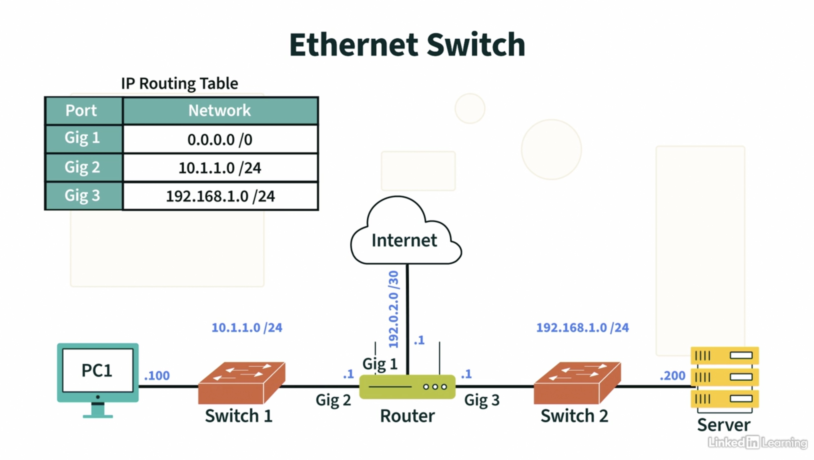
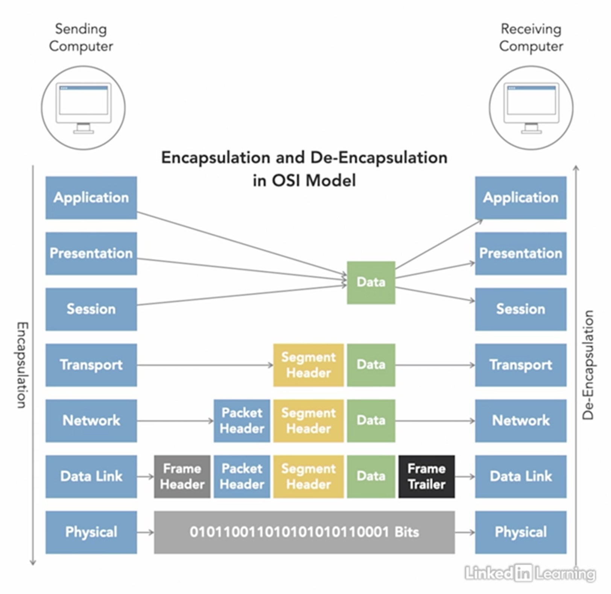

# Networking Foundations

- [Networking Foundations](#networking-foundations)
  - [Basics](#basics)
    - [Network Addresses](#network-addresses)
    - [Pieces & Parts of a Network](#pieces--parts-of-a-network)
      - [Network Interface Card (NIC)](#network-interface-card-nic)
      - [Switches](#switches)
      - [Routers](#routers)
      - [Copper Cabling](#copper-cabling)
      - [Protocol Data Units (PDUs)](#protocol-data-units-pdus)
    - [OSI Model](#osi-model)
      - [Layer 1: Physical Layer](#layer-1-physical-layer)
      - [Layer 2: Data Link Layer](#layer-2-data-link-layer)
      - [Layer 3: Network Layer](#layer-3-network-layer)
      - [Layer 4: Transport Layer](#layer-4-transport-layer)
      - [Layer 5: Session Layer](#layer-5-session-layer)
      - [Layer 6: Presentation Layer](#layer-6-presentation-layer)
      - [Layer 7: Application Layer](#layer-7-application-layer)
      - [TCP/IP Model](#tcpip-model)
      - [Some Common Protocols](#some-common-protocols)
    - [Network Services](#network-services)
      - [Dynamic Host Configuration Protocol](#dynamic-host-configuration-protocol)
      - [Network Address Translation](#network-address-translation)
      - [Network Time Protocol](#network-time-protocol)
    - [Wireless networks](#wireless-networks)
      - [2.4 GHz](#24-ghz)
      - [5 GHz](#5-ghz)
      - [Wi-Fi 6](#wi-fi-6)
  - [Protocols](#protocols)
    - [Address Resolution Protocol](#address-resolution-protocol)
    - [Internet Control Messaging Protocol (ICMP)](#internet-control-messaging-protocol-icmp)
    - [Internet Group Messaging Protocol (IGMP)](#internet-group-messaging-protocol-igmp)
    - [Domain Name Service (DNS)](#domain-name-service-dns)
    - [Transmission Control Protocol](#transmission-control-protocol)
    - [User Datagram Protocol](#user-datagram-protocol)
    - [Layer 4 ports](#layer-4-ports)
    - [Hypertext Transfer Protocol (HTTP/HTTPS)](#hypertext-transfer-protocol-httphttps)
    - [Post Office Protocol 3 (POP3)](#post-office-protocol-3-pop3)
    - [Internet Message Access Protocol (IMAP)](#internet-message-access-protocol-imap)
    - [Simple Mail Transfer Protocol (SMTP)](#simple-mail-transfer-protocol-smtp)
    - [Voice over Internet (VoIP)](#voice-over-internet-voip)
    - [Some VoIP-related Protocols](#some-voip-related-protocols)
      - [Session Initialization Protocol (SIP)](#session-initialization-protocol-sip)
      - [H.232](#h232)
      - [Media Gateway Control Protocol (MGCP)](#media-gateway-control-protocol-mgcp)
      - [Real-Time Transfer Protocol (RTP)](#real-time-transfer-protocol-rtp)
    - [File Transfer Protocol (FTP)](#file-transfer-protocol-ftp)
    - [Server Message Block (SMB)](#server-message-block-smb)
    - [Secure Shell (SSH)](#secure-shell-ssh)
    - [Remote Desktop Protocol (RDP)](#remote-desktop-protocol-rdp)
    - [Virtual Network Computing (VNC)](#virtual-network-computing-vnc)
    - [Simple Network Management Protocol (SNMP)](#simple-network-management-protocol-snmp)
  - [References](#references)

## Basics
Notes from Networking Foundations: Networking Basics video course on LinkedIn Learning.

### Network Addresses
- Media Access Control (MAC) Address: 48 bits long. 24 bits for vendor code, 24 bits for hardware id. 
  Typically written as 12 hexadecimal digits. E.g. 0e:98:4d:ac:4b:21.
- Internet Protocol (IP) v4 Address: 32 bits long. 
  Typically written as 4 decimal octets. E.g. 192.168.0.1
  Network address is separated from host address using subnet masks. 
  E.g. 192.168.0.0/24 indicates that the first 24 bits identify the network, leaving 8 bits for host addressing.
- Internet Protocol (IP) v6 Address: 128 bits long.
  Typically written as 32 hexadecimal quartets. E.g. 0b23:1e4a:9003:a34d:0000:0000:0000:0000. The zeros can be omitted.
  Network prefix (used to identify the network) is separated from host address.
  E.g. 0b23:1e4a:9003:a34d:0000:0000:0000:0000/64 indicates that the first 64 bits identify the network, leaving 64 bits for host addressing.

### Pieces & Parts of a Network

#### Network Interface Card (NIC)
Hardware component that is required to facilitate connections to networks

#### Switches

Connect devices on a network.
They route **frames** to appropriate destination within a network by keeping a Port <-> MAC address table.
They populate their MAC address tables using a technique called "flooding". 

#### Routers

Routers inter-connect different networks.
They transport **packets** across different networks which they aer connected to, i.e., routers have multiple (at least 2) network interfaces.
They store an IP Routing Table which associates network interfaces (e.g. ethernet ports) to networks.
`0.0.0.0/0` is a default network address which is often used to route traffic into the internet.
When multiple network addresses match the destination network on a **packet**, the most specific network (i.e., the network with the longest subnet mask) is selected.

#### Copper Cabling

#### Protocol Data Units (PDUs)
These are the units of data routed by different network layers/devices
- Switches: frames
- Routers: packets

### OSI Model

#### Layer 1: Physical Layer
PDU: bits.

#### Layer 2: Data Link Layer
Operates using physical addressing.
PDU: frames.

#### Layer 3: Network Layer
Operates using logical addressing.
PDU: packets.

#### Layer 4: Transport Layer
Establishes logical connections: reliable --- e.g. Transmission Control Protocol (TCP) / unreliable --- e.g. User Datagram Protocol (UDP).
PDU: segments (TCP)
PDU: datagram (UDP)

Layers 1-4 are know as the data segment layers.

#### Layer 5: Session Layer
Spins up and tears down communication sessions.
E.g. API sessions.

#### Layer 6: Presentation Layer
How data is presented.
Data encryption lives on this layer, so does data formatting (e.g. images in jpeg).

#### Layer 7: Application Layer
- User interfaces
- Hypertext Transfer Protocol (HTTP/HTTPS)
- Domain Name System (DNS)

#### TCP/IP Model
Typically combines layers 5-7 from the OSI model into a single "Application Layer".
Some variations of the TCP/IP model are shown below:

*4-layer TCP/IP*

*5-layer TCP/IP*

*TCP/IP Protocol Data Units*

#### Some Common Protocols
- HTTP: TCP 80
- HTTPS: TCP 443
- DNS: TCP/UDP 53
- Network Time Protocol (NTP): UDP 123
- Dynamic Host Configuration Protocol (DHCP): UDP 67

### Network Services

#### Dynamic Host Configuration Protocol
Dynamically assign IP addresses to Hosts on a network.

**Steps to DHCP (IP v4)**:
1. Discover: Host sends out a broadcast over the subnet to any available DHCP servers in an attempt to obtain their IP addresses
2. Offer: All DHCP servers that receive the Host's discover message send back an offer message with their respective IP addresses
3. Request: The Host makes a request for an IP address to the first DHCP server whose offer it receives
4. Acknowledge: The DHCP server provides the Host with an IP address, the network subnet mask, the address of the networks DNS server, and any other relevant information

**DHCP IP v6**
- Stateful

- Stateless

* EUI-64 generates the a 64-bit host address from the 48-bit MAC address of the Host

#### Network Address Translation
Makes it possible for all hosts on an internal network to use a limited number of internet-facing IP addresses.

**Private IP Addresses:**
Can be re-used in different internal networks without conflict. They are not publically routed.
- Class A: 10.0.0.0 to 10.255.255.255 (i.e., 10.0.0.0/8)
- Class B: 172.16.0.0 to 172.31.255.255 (i.e., 172.16.0.0/12)
- Class C: 192.168.0.0 to 192.168.255.255 (i.e., 192.168.0.0/16)

**Dynamic NAT:** 

Translate multiple internal local addresses to internal global addresses (multiple internet-facing IPs are available.)

**Port Address Translation (PAT):**

This is useful if a limited number of internet-facing IP addresses are available (e.g. 1).
Here, source ports are dynamically allocated to outbound connections from the Hosts.
The Router keeps an additional port information in its NAT Translation Table which it uses to forward incoming traffic to the appropriate Host.

#### Network Time Protocol

- Increment Stratum number per server hop, i.e. one NTP server connected to another NTP server (not per network hop)
- Stratum number >= 16: Invalid time

### Wireless networks

#### 2.4 GHz

- Maximum of 3 non-overlapping channels
- Better range (and penetration)

#### 5 GHz

- Over 20 non-overlapping channels (with the default 20 MHz channel width, this may reduce if channels are configured with channel bonding)
- Channel bonding: configure channels to use a larger channel width by combining channels. It allows for better throughput

#### Wi-Fi 6

## Protocols

### Address Resolution Protocol

- Used for IPv4 address resolution, IPv6 uses ICMPv6 messages
- IP <-> MAC mapping
- Static IP <-> MAC mapping possible but not recommended (i.e., no ARP)
1. Host checks its ARP cache for an entry with the packets destination IP address
2. If found, the frame header is encapsulated with the corresponding destination MAC address and sent
3. Otherwise, an ARP broadcast is sent onto the (switched) network with the request IP as the destination IP address
4. If a host is present on the network with the IP address, the host responds to the ARP request
5. The destination host's MAC address is then obtained and encapsulated into the frame and the frame is sent accordingly

### Internet Control Messaging Protocol (ICMP)

- Protocol number 1
- Part of the IP suite
- Does not carry any end user information
- Disable ICMP redirects for security
- Used for IPv6 address resolution (in place of ARP), neighbour discovery, router advertisement, etc.

**ICMP Header**
- Type: what is the purpose of the packet? e.g. destination unreachable, redirect, echo request, echo response, etc.
- Code: more granular specification of the purpose. E.g. destination unreachable -> destination unknown

### Internet Group Messaging Protocol (IGMP)
- Used for Multicasting in IPv4, IPv6 uses ICMPv6
- Multicast: Single host -> multiple hosts
- Allows hosts to join multicast groups
- Note: Multicasting via IGMP occurs at level 3 (at the routers --- Network layer)
- Switches forward all broadcasts to all hosts on the switched network
- To facilitate multicasting to only members of the multicast groups, switches umplement IGMP snooping

### Domain Name Service (DNS)

1. Host A wants to send traffic to www.a.com
2. Host A checks its DNS cache for www.a.com, if a matching record is found, Host A encapsulates the packet wit the found IP address
3. If a matching record is not found, Host A makes a DNS query to its DNS server (UDP port 53)
4. Host A's DNS server checks its cache for www.a.com, if a record is found, the corresponding IP address is sent back to Host A
5. Otherwise, Host A's DNS server looks up its root hints file and makes a DNS query to a root DNS server
6. The root DNS server then sends back the IP address of the TLD (.com in this case)
7. Host A's DNS server then sends a query to .com TLD DNS server, to which it gets the IP address of the www.a.com's Authoritative DNS server 
8. Host A's DNS server then sends a query to the Authoritative DNS server, and gets back www.a.com's IP address
9. Host A's DNS server then caches this and sends it back to Host A

### Transmission Control Protocol

- Connection-oriented
- Three way handshake to establish connection
- Offers reliability
- When data the amount of (window size) has been sent, 
  the sender waits to receive acknowledgement from the receiver before it continues to send
- If no acknowledgement is received, the last batch of data is retransmitted
- Due to numbering of packets, the receiver can figure out if it has missed a packet,
  then it can request retransmission of the missing packet from the sender

### User Datagram Protocol
- Connectionless
- No acknowledgement, no order
- unreliable
- Faster

### Layer 4 ports
- 16-bit numbers to open communication lines
- Well-known ports: < 1024
- Ephemeral ports: > 1024
- Services/applications can open up a port and wait for incoming connections on the port, this is called **listening**
- When a client connects to an application via a well-known port, the client connection is often moved to an ephemeral port such that other connections can be received
- TCP: port 0 cannot be used, it is reserved
- UDP: source port is optional, 0 means no port is used
- Binding an internet socket: transport protocol + port + IP address IP + port combination must be unique per host

*TCP/IP Packet Header*

### Hypertext Transfer Protocol (HTTP/HTTPS)
- TCP port 80
- HTTPS: TCP port 443
HTTP Methods
- GET: retrieve data
- HEAD: GET without the data
- POST: perform action / pass information to server

HTTP Response Code
- 1XX: Informational
- 2XX: Successful
- 3XX: Redirection
- 4XX: Client Error
- 5XX: Server Error

### Post Office Protocol 3 (POP3)
- Used by email clients to retrieve messages from an email server
- TCP port 110
- POP3S (TLS/SSL): TCP port 995
- Default behaviour: download to device, delete from server
- Single connection at a time

### Internet Message Access Protocol (IMAP)
- Used by email clients to retrieve messages from an email server
- TCP port 143
- IMAPS: TCP port 993
- Default bahaviour: email stays on server (doesn't delete by default)
- Clients can access email from multiple devices
- Supports multiple connections at a time
- Tracks message state, e.g. read, replied, etc.
- Supports server-side searches

### Simple Mail Transfer Protocol (SMTP)
- Used for sending and receiving emails, especially between servers
- Client use SMTP to submit outgoing emails, but use IMAP (or POP3) for retrieval
- TCP port 25 (plaintext communication)
- TCP port 587 (encrypted communication)

### Voice over Internet (VoIP)
- Carries voice traffic digitally over a network

### Some VoIP-related Protocols
#### Session Initialization Protocol (SIP)
- Signaling and control protocol: used for voice and video over IP, instant messaging, etc.
- Primarily responsible for establishing and terminating communications
- TCP and UDP port 5060 for plaintext
- TCP and UDP port 5061 for TLS
- Packets are similar to HTTP (e.g. header fields & encoding rules)
- Uses Uniform Resource Identifiers (URI), of the general format: `sip:username:password@host:port`
- Uses office phones as user agents
  
#### H.232
- Signaling and control protocol
- TCP & UDP ports 1718 - 1720
- Most often used as a gateway for VoIP services

#### Media Gateway Control Protocol (MGCP)
- Signaling & control protocol
- Gateway of phone system to the Public Switched Telephone Network (PSTN)
- allows phone system to control the gateway
- TCP port 2428, UDP port 2427

#### Real-Time Transfer Protocol (RTP)
- Works with a signaling & control protocol (e.g. those listed above)
- Transfers voice and video
- Real-Time Control Protocol (RTCP) periodically send stats to participants (but carries no voice data)
- Detects out of sequence packets and corrects jitter
- Support multicast
- Employs error concealment algorithm
- UDP ports 16384 - 32767
- RTP port even, RTCP port odd (next odd port after the corresponding RTP port)

### File Transfer Protocol (FTP)
- TCP port 21 for initialization 
- TCP port 20 for transfer (active mode), or some port specified by server (passive mode)

### Server Message Block (SMB)
- Application layer protocol for sharing files, printer, & serial ports
- TCP port 445
- Most often used for Windows File Sharing
- Samba: Open-source implementation of SMB
  - Allows linux devices to act as servers or clients

### Secure Shell (SSH)
- TCP port 22

### Remote Desktop Protocol (RDP)
- TCP port 3389 
- Audio redirection
- File system redirection
- Printer redirection
- Port redirection
- Clipboard sharing
- Open-source and browser-based version

### Virtual Network Computing (VNC)
- Uses Remote Frame Buffer Protocol (RFBP) to remotely control another computer
- TCP port 5900+N, where N is the display number (:0 for physical display)

### Simple Network Management Protocol (SNMP)
- Gathers statistical info from network connected devices

## References
- [Networking Foundations: Networking Basics](https://www.linkedin.com/learning/networking-foundations-networking-basics)
- [Networking Foundations: Protocols and CLI Tools](https://www.linkedin.com/learning/networking-foundations-protocols-and-cli-tools-14049306/)
- [Virtual Network Computing - Wikipedia](https://en.wikipedia.org/wiki/Virtual_Network_Computing)
