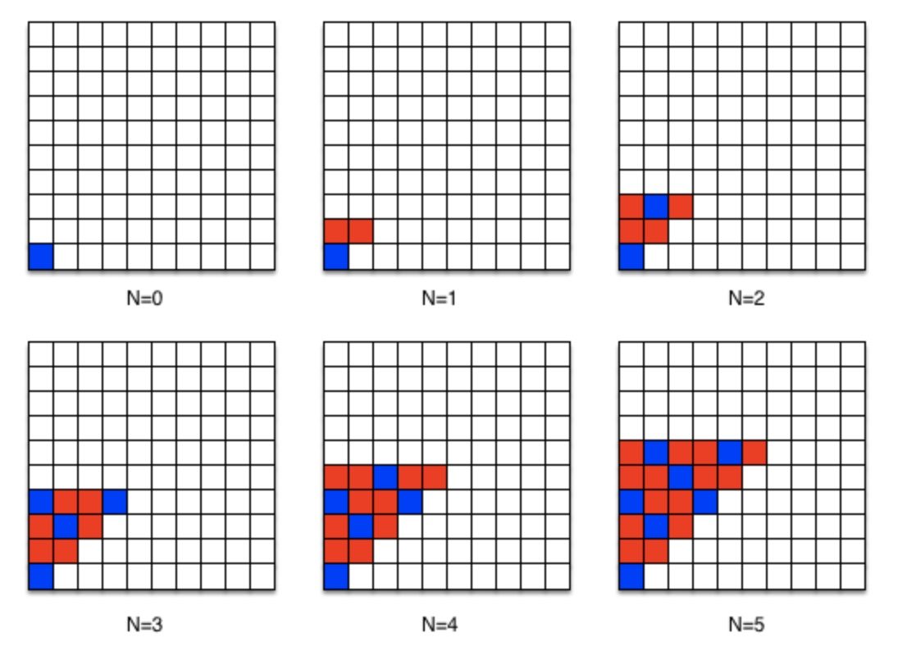

# Programming Foundations

- [Programming Foundations](#programming-foundations)
  - [Algorithmic Design](#algorithmic-design)
    - [Basic Steps](#basic-steps)
    - [Example: A Pattern Of Squares](#example-a-pattern-of-squares)
  - [References](#references)

## Algorithmic Design
### Basic Steps
1. **Work out multiple instance yourself**: Work out multiple instances of the problem by hand. 
Be sure to make each step as clear & concise as possible. 
Some steps might be complex and might require being solved with an algorithm themselves.
If you are having problems with this step, you might lack domain knowledge, or the problem might be ill-specified.

2. **Write down your steps from 1**: Write down the steps that we used to solve the problem from 1 above.
For example, to compute *x* to the power of *y*, for the "instance" where *x = 3* and *y = 4*, we might list the following steps:
```
Multiply 3 by 3
    You get 9
Multiply 3 by 9
    You get 27
Multiply 3 by 27
    You get 81
81 is your answer.
```

3. **Generalize your steps from 2**: Compare and contrast the solutions from 2 and try to decern them into a generalized solution.
Extract values into variables and repetitions into loops.
Following the same example of *3* to the power pf *4* from Step 2 above, we can have:
```
Multiply x by 3
    You get 9
Multiply x by 9
    You get 27
Multiply x by 27
    You get 81
81 is your answer.
```

Then:
```
Start with n = 1
n = Multiply x by n
n = Multiply x by n
n = Multiply x by n
n = Multiply x by n
n is your answer
```

Then:
```
Start with n = 1
Count up from 1 to y (inclusive), for each count,
    n =  Multiply x by n
n is your answer
```

4. **Test your generalized solution**: Test your generalized solution, first, on all the cases for which Step 1 was carried out.
Also test corner cases for the variables contained in the algorithm.
If your generalized solution fails for a test case, perform steps 1 & 2 on the particular failed test and incorporate these into your generalization in step 3.

### Example: A Pattern Of Squares


1 & 2. Work out multiple instances and write down your steps:

- n = 0: 
    ```
    Place a blue square at the bottom left corner (x=0, y=0)
    ```

- n = 1:
    ```
    Place a blue at the bottom left corner (x=0, y=0)

    Place a red at 1st and 2nd rows on the 2nd column from the bottom (x=0, y=1),  (x=1, y=1)
    ```

- n = 2:
    ```
    Place a blue at the bottom left corner (x=0, y=0)

    Place a red at 1st and 2nd rows on the 2nd column from the bottom (x=0, y=1),  (x=1, y=1)

    Place a red at the 1st row on the 3rd column from the bottom (x=0, y=2)
    Place a blue at the 2nd row on the 3rd column from the bottom (x=1, y=2)
    Place a red at the 3rd row on the 3rd column from the bottom (x=2, y=2)
    ```

- n = 3:
    ```
    Place a blue at the bottom left corner (x=0, y=0)

    Place a red at 1st and 2nd rows on the 2nd column from the bottom (x=0, y=1),  (x=1, y=1)

    Place a red at the 1st row on the 3rd column from the bottom (x=0, y=2)
    Place a blue at the 2nd row on the 3rd column from the bottom (x=1, y=2)
    Place a red at the 3rd row on the 3rd column from the bottom (x=2, y=2)

    Place a blue at the 1st row on the 4th column from the bottom (x=0, y=3)
    Place a red at the 2nd  and 3rd rows on the 4th column from the bottom (x=1, y=3), (x=2, y=3)
    Place a blue at the 4th row on the 4th column from the bottom (x=3, y=3)
    ```

- n = 4:
    ```
    Place a blue at the bottom left corner (x=0, y=0)

    Place a red at 1st and 2nd rows on the 2nd column from the bottom (x=0, y=1),  (x=1, y=1)

    Place a red at the 1st row on the 3rd column from the bottom (x=0, y=2)
    Place a blue at the 2nd row on the 3rd column from the bottom (x=1, y=2)
    Place a red at the 3rd row on the 3rd column from the bottom (x=2, y=2)

    Place a blue at the 1st row on the 4th column from the bottom (x=0, y=3)
    Place a red at the 2nd  and 3rd rows on the 4th column from the bottom (x=1, y=3), (x=2, y=3)
    Place a blue at the 4th row on the 4th column from the bottom (x=3, y=3)

    Place a red at the 1st and 2nd rows on the 5th column from the bottom (x=0, y=4), (x=1, y=4)
    Place a blue at the 3rd row on the 5th column from the bottom (x=2, y=4)
    Place a red at the 4th and 5th rows on the 5th column from the bottom (x=3, y=4), (x=4, y=4)
    ```

- n = 5:
    ```
    Place a blue at the bottom left corner (x=0, y=0)

    Place a red at 1st and 2nd rows on the 2nd column from the bottom (x=0, y=1),  (x=1, y=1)

    Place a red at the 1st row on the 3rd column from the bottom (x=0, y=2)
    Place a blue at the 2nd row on the 3rd column from the bottom (x=1, y=2)
    Place a red at the 3rd row on the 3rd column from the bottom (x=2, y=2)

    Place a blue at the 1st row on the 4th column from the bottom (x=0, y=3)
    Place a red at the 2nd  and 3rd rows on the 4th column from the bottom (x=1, y=3), (x=2, y=3)
    Place a blue at the 4th row on the 4th column from the bottom (x=3, y=3)

    Place a red at the 1st and 2nd rows on the 5th column from the bottom (x=0, y=4), (x=1, y=4)
    Place a blue at the 3rd row on the 5th column from the bottom (x=2, y=4)
    Place a red at the 4th and 5th rows on the 5th column from the bottom (x=3, y=4), (x=4, y=4)

    Place a red at the 1st row on the 6th column from the bottom (x=0, y=5)
    Place a blue at the 2nd row on the 6th column from the bottom (x=1, y=5)
    Place a red at the 3rd and 4th rows on the 6th column from the bottom (x=2, y=5), (x=3, y=5)
    Place a blue at the 5th row on the 6th column from the bottom (x=4, y=5)
    Place a red at the 6th row on the 6th column from the bottom (x=5, y=5)
    ```

3. Generalize:

```
Count from 0 to N (inclusive), for each count as i,
    if i = 0
        Place a blue square at (x=0, y=0)
    if i = 1
        Place a red square at (x=0, y=1)
        Place a red square at (x=1, y=1)
    if i = 2
        Place a red square at (x=0, y=2)
        Place a blue square at (x=1, y=2)
        Place a red square at (x=2, y=2)
    if i = 3
        Place a blue square at (x=0, y=3)
        Place a red square at (x=1, y=3)
        Place a red square at (x=2, y=3)
        Place a blue square at (x=3, y=3)

    if i = 4
        Place a red square at (x=0, y=4)
        Place a red square at (x=1, y=4)
        Place a blue square at (x=2, y=4)
        Place a red square at (x=3, y=4)
        Place a red square at (x=4, y=4)

    if i = 5
        Place a red square at (x=0, y=5)
        Place a blue square at (x=1, y=5)
        Place a red square at (x=2, y=5)
        Place a red square at (x=3, y=5)
        Place a blue square at (x=4, y=5)
        Place a red square at (x=5, y=5)
```

```
Count from 0 to N inclusive, for each count as i,
    Count from 0 to i inclusive, for each count as j,
        k = i + j
        if dividing k by 3 leaves no remainder,
            Place a blue square at (x=j, y=i)
        otherwise,
            Place a red square at (x=j, y=i)
```

## References
- [Programming Fundamentals - Coursera](https://www.coursera.org/learn/programming-fundamentals)
